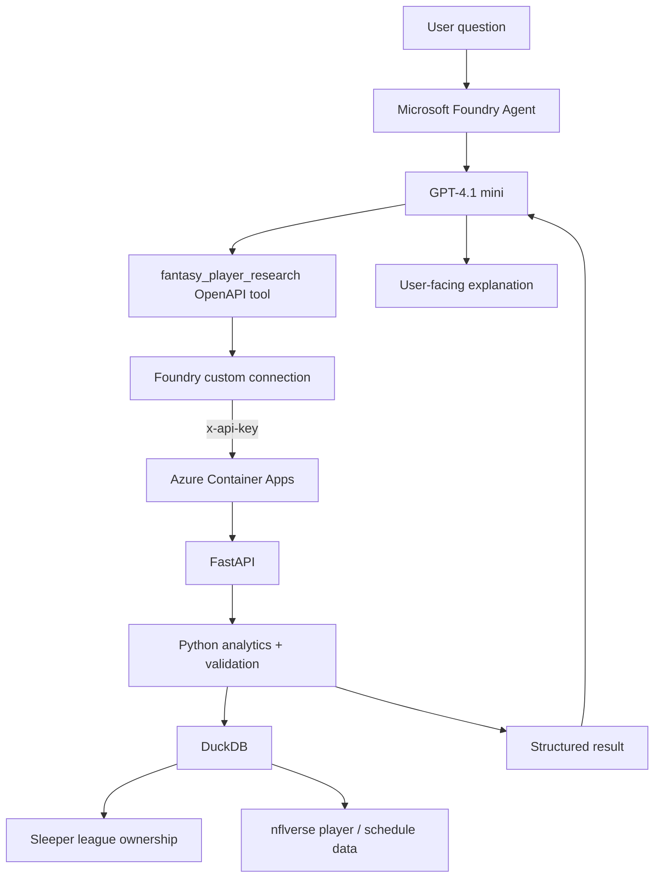
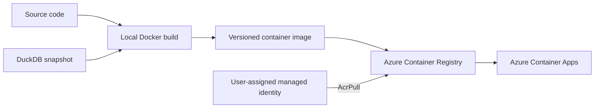

# Fantasy Research Agent — Architecture

**Last updated:** October 5, 2026

## Architectural goal

Fantasy Research Agent separates **reasoning** from **calculation**.

The language model decides what evidence it needs and explains the result. Structured code and databases produce the facts.

```text
LLM = planner + explainer
Python = validator + orchestration
DuckDB / SQL = calculator
Sleeper + nflverse = evidence sources
FastAPI / OpenAPI = service contract
Azure = cloud runtime
```

## Runtime architecture



## Deployment architecture



## Core components

### Sleeper API

Provides league-specific state:

- user and league identity
- roster ownership
- starters and bench
- scoring rules
- managers / fantasy teams
- inference of unrostered players

Sleeper supplies the context that turns generic NFL statistics into league-specific fantasy research.

### nflverse / nflreadpy

Provides NFL-side evidence:

- player identifier mappings
- weekly player statistics
- snap counts
- weekly roster status
- schedules

The project will later expand into play-by-play and richer opportunity metrics.

### DuckDB

Current analytical store.

Important tables include:

- `player_identity`
- `league_ownership`
- `nfl_schedule`
- `player_week`
- weekly stats / status / snap tables

DuckDB performs deterministic joins, filtering, averaging, ranking, and trend calculations.

The current Azure container carries a snapshot of this database. This is intentionally temporary.

### Python analytics layer

Key responsibilities:

- data normalization
- identifier mapping
- semantic guardrails
- query validation
- position / availability filtering
- time-window logic
- completed-week checks
- trend calculations
- structured result generation

A central generic tool is `search_players()`.

### FastAPI

FastAPI is the network boundary around deterministic analytics.

Current relevant endpoints:

```text
GET  /health
POST /tools/search-players
```

`/docs` exposes Swagger for developer testing and FastAPI also produces the OpenAPI contract.

### API authentication

The analytics endpoint requires:

```text
x-api-key
```

FastAPI validates the header using `APIKeyHeader`.

The expected secret is read from:

```text
FANTASY_API_KEY
```

The secret is not stored in source code.

### Azure Container Apps

Runs the FastAPI Docker image on a public HTTPS endpoint.

It is the bridge that makes local analytics reachable by Microsoft Foundry.

### Azure Container Registry

Stores versioned backend images:

```text
fantasy-research-api:v1
fantasy-research-api:v2
```

The secured API is represented by the later image.

### Azure Managed Identity

A user-assigned identity gives the Container App `AcrPull` permission.

This means the app can retrieve its private ACR image without storing registry credentials.

### Azure Container Apps secret

Stores the backend API key and injects it into the container as an environment variable.

### Microsoft Foundry

Current cloud AI layer:

- Foundry project `fantasy-research-agent`
- GPT-4.1 mini model deployment
- prompt agent `fantasy-research-agent`
- custom OpenAPI tool `fantasy_player_research`
- custom secret connection for `x-api-key`
- traces for tool/model execution debugging

### Foundry custom connection

Stores the API credential as a secret.

The actual OpenAPI schema contains only the security contract:

```text
header name: x-api-key
```

It does not contain the credential value.

## Request lifecycle

For a query such as:

> What unrostered WRs in my league have the strongest target volume?

the intended execution path is:

```text
1. User asks question
2. Foundry agent interprets intent
3. Agent calls fantasy_player_research
4. Foundry adds x-api-key from secret connection
5. HTTPS request reaches Azure Container Apps
6. FastAPI authenticates request
7. Request arguments are validated
8. search_players() queries DuckDB
9. Ownership + player metrics are ranked
10. Structured rows return to Foundry
11. GPT-4.1 mini explains the returned evidence
```

The model should never invent missing statistics to fill gaps.

## Reliability principles

### Numbers come from tools

The LLM is not the source of truth for:

- player availability
- targets / carries
- snap share
- fantasy scoring
- usage trends
- league ownership

### Missing data is not zero

The backend preserves meaningful nulls instead of silently converting unknown data into zero.

### Trends require enough completed data

Trend calculations require at least two fully completed NFL weeks.

### Partial weeks are handled explicitly

The NFL schedule is used to determine the latest fully completed week.

### Tool failure should be visible

If a tool fails or returns insufficient evidence, the agent should report that rather than fabricate an answer.

## Known architectural limitation

The cloud runtime is currently **stateful only through the baked DuckDB snapshot**.

That means:

```text
local refresh
→ rebuild Docker image
→ push new image
→ redeploy
```

is currently required to refresh cloud data.

This was acceptable for the first vertical slice because it isolated and proved:

- containerization
- cloud deployment
- networking
- identity
- API security
- OpenAPI tool calling
- Foundry orchestration

The next data architecture should separate persistent/refreshable data from the application image.

## Planned evolution

```text
Current:
Foundry
→ secured FastAPI
→ DuckDB snapshot

Next:
Frontend
→ same real API

Then:
scheduled data sync
→ Azure-backed persistence / cache
→ multi-league support

Then:
play-by-play + advanced opportunity metrics
→ injuries/news/weather retrieval
→ predictive projections
→ backtesting / evaluation
```

## Non-goals right now

The project should not add technology only for résumé decoration.

Specifically:

- do not force Cosmos DB when relational data fits better
- do not use `async/await` everywhere unless I/O concurrency benefits
- do not call descriptive usage data a projection
- do not use vector RAG for numeric facts that SQL can retrieve exactly
- do not allow the model to generate chart numbers
