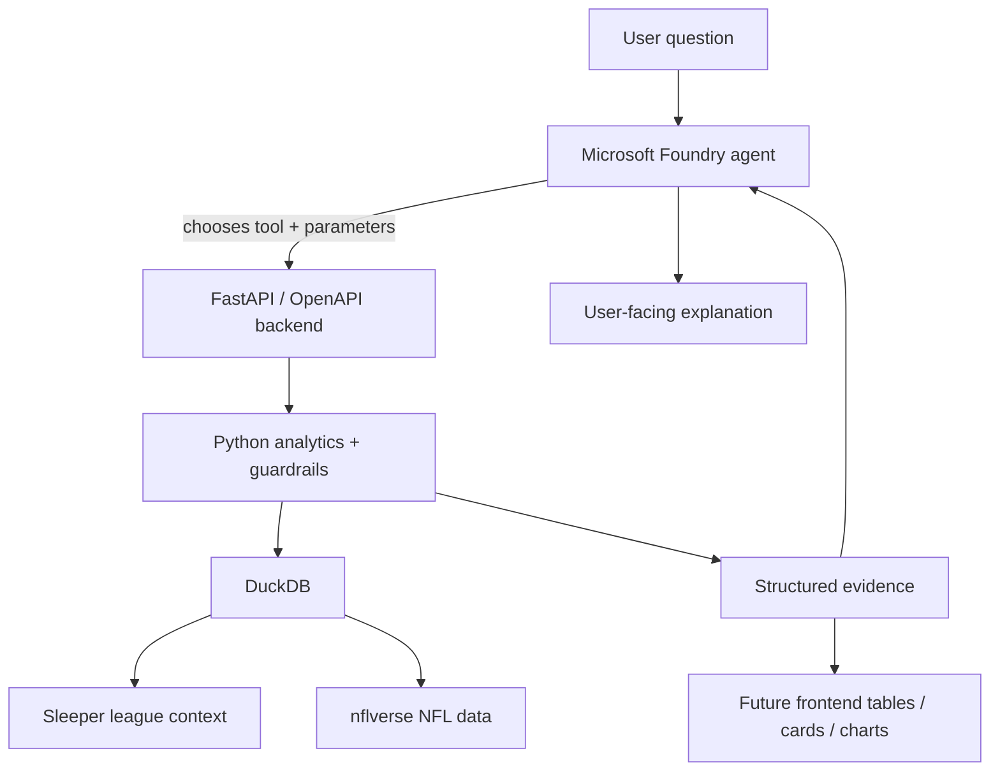
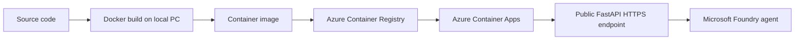

# Fantasy Research Agent

> **Technical Project Journal, Architecture Notes, and Engineering Write-Up Source**  
> A living document for learning, portfolio documentation, and a future public write-up.

**Status:** Local data + analytics complete; FastAPI works locally; Azure/Foundry deployment in progress  
**Primary goal:** Build an evidence-first fantasy football research agent while gaining practical Microsoft Azure and Foundry experience  
**Core stack:** Python, Sleeper API, nflverse, Polars, DuckDB, FastAPI, OpenAPI, Foundry Local, Microsoft Foundry, Docker, WSL 2, Azure Container Registry, Azure Container Apps  
**Last updated:** October 5, 2026

---

## Table of Contents

1. [Project Overview](#1-project-overview)
2. [Design Philosophy](#2-design-philosophy)
3. [Current Architecture](#3-current-architecture)
4. [Component Guide](#4-component-guide)
5. [Why FastAPI Exists If Azure Already Exists](#5-why-fastapi-exists-if-azure-already-exists)
6. [What Has Been Built So Far](#6-what-has-been-built-so-far)
7. [How a User Question Flows Through the System](#7-how-a-user-question-flows-through-the-system)
8. [Key Engineering Decisions and Lessons](#8-key-engineering-decisions-and-lessons)
9. [Docker and WSL in This Project](#9-docker-and-wsl-in-this-project)
10. [Current State and Immediate Next Milestones](#10-current-state-and-immediate-next-milestones)
11. [Engineering Journey](#11-engineering-journey)
12. [Framing the Future Public Write-Up](#12-framing-the-future-public-write-up)
13. [Short Portfolio Summary](#13-short-portfolio-summary)
14. [Repository Shape](#14-repository-shape)
15. [Current Cloud Topology](#15-current-cloud-topology)
16. [How to Maintain This Journal](#16-how-to-maintain-this-journal)

---

# 1. Project Overview

**Fantasy Research Agent** is an AI-assisted fantasy football research system designed to answer natural-language questions with league-specific, data-backed evidence.

The long-term product is not intended to be just another chatbot or a static start/sit page. The goal is to build something closer to a research analyst that understands a user's actual fantasy league, roster, scoring settings, player usage, ownership, availability, and eventually predictive context.

The project began with local data ingestion and deterministic analytics, then deliberately expanded into Microsoft Azure and Microsoft Foundry. The cloud work is not decorative. A major goal of the project is to learn how a modern AI application is actually assembled in practice: data pipelines, analytics, tool calling, API contracts, cloud deployment, permissions, containerization, observability, and eventually a production-style frontend.

### Project thesis

> The system is intentionally split into deterministic analytics and AI reasoning. Statistics are calculated by code and queried from structured data. The model decides what evidence it needs, calls the appropriate tool, and explains the returned result.

That separation is the foundation of the project.

---

# 2. Design Philosophy

The most important architectural decision is to **separate calculation from interpretation**.

Large language models are useful planners, researchers, and communicators, but they should not invent box-score numbers, ownership status, usage trends, or league context. The application therefore treats the model as the reasoning layer and deterministic code as the source of truth.

The system can be thought of as four cooperating roles:

- **AI planner:** interprets a freeform question and decides which tool, filters, metrics, and time window are needed.
- **Python referee:** validates tool arguments and enforces semantic guardrails, such as interpreting "available" as "unrostered."
- **DuckDB calculator:** executes joins, filters, averages, rankings, and trend calculations against structured data.
- **AI explainer:** turns returned evidence into a concise fantasy-football answer without fabricating statistics.

### Evidence-first rule

> The model may decide what to investigate, but the numbers must come from deterministic code and structured data. When evidence is missing or immature, the system should say so instead of silently substituting a guess.

This makes the application more reproducible, auditable, and easier to debug.

---

# 3. Current Architecture

The current system is intentionally layered.



During development there are currently **two AI paths**:

1. **Foundry Local** provides a local model runtime used as a development harness for structured tool calling.
2. **Microsoft Foundry in Azure** is the cloud orchestration layer that will ultimately call the hosted FastAPI tools.

The local path is useful for development and experimentation. The Azure path is the production-shaped architecture.

---

# 4. Component Guide

This section explains what each technology is in general and what it specifically does inside Fantasy Research Agent.

| Component | What it is generally | Role in this project | Current state |
|---|---|---|---|
| **Sleeper API** | A public API for Sleeper fantasy leagues, users, rosters, scoring settings, and player metadata. | Supplies league-specific context: league ID, roster ownership, starters, bench, scoring rules, managers, and unrostered-player inference. | Implemented |
| **nflverse / nflreadpy** | Open NFL datasets exposed through a Python package. | Supplies weekly player stats, schedules, roster status, snap counts, and identifier mappings used to analyze actual NFL usage. | Implemented |
| **Python** | The main programming language for the backend. | Coordinates ingestion, cleaning, ID mapping, analytics, tool validation, API logic, and refresh workflows. | Implemented |
| **Polars** | A high-performance dataframe library. | Transforms Sleeper and nflverse-derived data before it is persisted or returned to the application. | Implemented |
| **DuckDB** | An embedded analytical SQL database optimized for local analytics. | Stores normalized tables such as `player_week` and `league_ownership` and performs fast joins, filters, averages, and trend calculations. | Implemented locally |
| **FastAPI** | A modern Python web API framework. | Turns internal analytics functions into stable HTTP endpoints that a frontend or AI agent can call. | Working locally |
| **OpenAPI** | A machine-readable standard for describing HTTP APIs. | FastAPI generates the schema automatically. Foundry can use that contract to understand available tools and their arguments. | Generated locally |
| **Uvicorn** | An ASGI server used to run Python web applications. | Runs the FastAPI app during local development. | Implemented |
| **Foundry Local** | Microsoft's local AI runtime and SDK. | Used as a development harness to test structured tool calling with a local Qwen model before relying on cloud inference. | Implemented |
| **Microsoft Foundry** | Microsoft's cloud AI development and orchestration platform. | Hosts the cloud project, model deployment, and agent that will reason over deterministic FastAPI tools. | Configured |
| **GPT-4.1 mini** | A cloud language model deployment. | Acts as the cloud reasoning model that will choose tools, interpret evidence, and generate user-facing explanations. | Deployed |
| **Docker** | A containerization platform that packages an application and its dependencies into a reproducible image. | Packages FastAPI, Python dependencies, backend code, and initially a database snapshot so Azure can run the same application environment. | Installed; local build next |
| **WSL 2** | Windows Subsystem for Linux, a lightweight Linux environment on Windows. | Provides the Linux environment Docker Desktop uses to build and run Linux containers from the Windows development machine. | Installed; verification in progress |
| **Azure Container Registry (ACR)** | A private registry for storing container images. | Stores the locally built `fantasy-research-api` image before Azure Container Apps pulls and runs it. | Registry created; image push pending |
| **Azure Container Apps** | A managed Azure service for running containerized web services without managing virtual machines. | Will host the FastAPI backend on a public HTTPS endpoint so the Foundry cloud agent can reach it. | Environment created; deployment pending |
| **Git + GitHub** | Version control plus hosted source repository. | Tracks code, architecture notes, engineering decisions, project history, and this journal. | Implemented |

---

# 5. Why FastAPI Exists If Azure Already Exists

A useful mental model is that **Azure is the cloud platform, while FastAPI is the application**.

Azure is not one database or one application framework. It is a large collection of cloud services that can host code, store data, run models, manage secrets, monitor systems, and provide networking.

For this project:

```text
Azure                    = cloud platform
FastAPI                  = backend application / interface
DuckDB                   = current analytical data store
Microsoft Foundry        = AI orchestration and reasoning
Azure Container Apps     = hosting for FastAPI
Azure Container Registry = storage for the Docker image
```

FastAPI becomes the stable interface between the frontend, the AI agent, authentication, analytics, and storage.

For example, instead of allowing a model to directly rummage through the database, the model can call a controlled operation such as:

```http
POST /tools/search-players
```

FastAPI receives that request, validates the arguments, invokes the deterministic analytics layer, and returns structured results.

That separation matters because the storage implementation can change later without forcing the rest of the application to change. DuckDB could eventually be supplemented or replaced by an Azure-hosted database, while the frontend and Foundry agent can continue calling the same API contract.

---

# 6. What Has Been Built So Far

## 6.1 League and player data foundation

The ingestion pipeline accepts a Sleeper username, identifies the active league and roster, loads league ownership, maps Sleeper player IDs to nflverse/GSIS identifiers, loads weekly NFL data, and writes normalized analytics tables to DuckDB.

The current refresh pipeline produces data for:

- player identity
- roster mapping
- league ownership
- weekly player statistics
- snap counts
- weekly roster status
- NFL schedules
- unified `player_week` rows

The `player_week` table is especially important because it gives later research tools a consistent row-per-player-per-week source.

## 6.2 Schedule-aware analytics

The project explicitly distinguishes fully completed NFL weeks from partial current-week data.

Trend calculations use only completed weeks, and the tool refuses to report a trend when fewer than two completed weeks are available. This prevents mathematically valid-looking but misleading slopes from being presented as meaningful trends.

This is a small implementation detail with a large reliability benefit.

## 6.3 Generic player research tool

Instead of hard-coding a separate function for every possible fantasy question, the backend uses a composable `search_players()` tool.

A call can look conceptually like this:

```python
search_players(
    position="WR",
    availability="unrostered",
    sort_by=["avg_targets", "avg_snap_pct"],
    last_n_weeks=3,
    limit=10,
)
```

The same tool supports:

- position filtering
- ownership / availability filtering
- multiple ranking metrics
- numerical filters
- recent-week windows
- usage trends
- fantasy-point trends

This approach scales much better than creating a unique function for every natural-language question.

## 6.4 Structured local agent

The local AI prototype originally experimented with direct text-to-SQL generation. That proved too fragile because a model could produce invalid queries or misunderstand the data model.

The architecture evolved into **structured tool calling**.

The model now requests a defined tool with structured arguments. Python validates those arguments, executes deterministic analytics, and returns the result to the model for explanation.

A semantic guardrail also corrects important intent mismatches. For example, if the user asks for "available" players, Python enforces `unrostered` availability even if the model proposes a broader value.

The agent also falls back gracefully when trend evidence is not yet mature rather than pretending a projection exists.

## 6.5 FastAPI boundary

The deterministic search tool is now exposed through FastAPI.

The local service successfully starts with Uvicorn and provides:

```text
http://127.0.0.1:8000/docs
http://127.0.0.1:8000/openapi.json
```

`/docs` exposes interactive Swagger documentation for a developer. `/openapi.json` exposes the same API contract in a machine-readable form.

This is the boundary that turns internal Python functions into a service that other systems can call.

## 6.6 Microsoft Foundry cloud setup

A Microsoft Foundry resource and project have been created in Azure.

Current cloud configuration includes:

- Azure for Students subscription
- resource group `rg-fantasy-research-agent`
- Foundry resource `fantasy-research-foundry-nj`
- Foundry project `fantasy-research-agent`
- `gpt-4.1-mini` deployment
- prompt agent `fantasy-research-agent`

The agent instructions emphasize that it should prefer tool-provided evidence and should not invent statistics, injuries, matchups, or league information.

Azure role-based access control also became part of the setup. Infrastructure ownership alone did not provide the required Foundry data-plane access, so the **Foundry User** role had to be assigned.

---

# 7. How a User Question Flows Through the System

A future user may ask:

> "Which waiver WRs have the best upside?"

The intended flow is:

1. The user asks a freeform fantasy question.
2. The Foundry agent interprets the request and chooses a research tool plus structured parameters.
3. The agent calls a FastAPI endpoint described by the OpenAPI schema.
4. FastAPI validates the request and calls the deterministic Python analytics layer.
5. DuckDB queries league ownership and NFL usage data.
6. Python applies semantic and data-quality guardrails.
7. FastAPI returns structured evidence, including real player names and calculated metrics.
8. The Foundry model explains the evidence to the user.
9. A future frontend renders the same returned data as tables, cards, and charts.

### Why this flow matters

The AI is not being asked to "remember" fantasy football data. It receives a controlled way to retrieve current, league-specific evidence.

That means the language model can eventually be changed without rebuilding the data and analytics architecture underneath it.

---

# 8. Key Engineering Decisions and Lessons

## 8.1 Deterministic analytics over model-generated numbers

The model is intentionally prevented from becoming the calculator.

Fantasy statistics, roster availability, and rankings are produced by queryable data and code. This increases reproducibility and makes debugging possible.

## 8.2 Generic tools over endpoint explosion

The application avoids building a unique function for every possible fantasy question.

A smaller set of composable tools can cover many questions by changing parameters. This keeps the backend maintainable while still allowing flexible AI planning.

## 8.3 Partial-week data is a first-class problem

Sports data is constantly changing.

A naive average can mix completed games with partial current-week records. The schedule table therefore acts as a source of truth for completed weeks, and trend logic uses that boundary explicitly.

## 8.4 Missing data is not zero

An absent box-score record, an inactive player, and a player who actually recorded zero usage are different states.

The system preserves nulls where appropriate rather than silently turning missing values into fake performance.

## 8.5 Azure permissions have multiple layers

The cloud setup exposed a useful distinction between **control-plane permissions** and **service-specific data-plane permissions**.

Owning the Azure resource did not automatically grant the permissions required to create and use Foundry agents. The Foundry User role was required separately.

## 8.6 Cloud provider registration is infrastructure setup

Before Container Apps could be used, the subscription needed Azure resource providers such as:

```text
Microsoft.App
Microsoft.OperationalInsights
Microsoft.ContainerRegistry
```

These are Azure platform prerequisites, not bugs in application code.

## 8.7 Student subscription limitations can affect deployment strategy

The first Container Apps deployment attempt used Azure Container Registry Tasks to build the Docker image in the cloud.

Azure for Students did not permit that ACR Tasks operation. Rather than abandoning the architecture, the project changed the build path:

```text
Local Docker build
        ↓
Azure Container Registry
        ↓
Azure Container Apps
```

This preserves the same production architecture while moving the image build step onto the development machine.

### Engineering takeaway

> A failed cloud deployment is not automatically a code failure. Application errors, identity problems, subscription restrictions, networking issues, provider registration, and platform constraints are different categories of failure and should be debugged separately.

---

# 9. Docker and WSL in This Project

## Docker

Docker solves **environment reproducibility**.

Before containerization, the backend depends on the development machine having the correct Python version, installed packages, source code, data files, and startup command.

A `Dockerfile` records that runtime as a recipe.

Conceptually:

```text
Docker image
├── Linux runtime
├── Python 3.13
├── FastAPI
├── DuckDB / analytics dependencies
├── backend source code
└── startup command
```

Docker builds that recipe into a container image that can run consistently on the developer machine or in Azure.

The important shift is from:

> "This Python program works on my laptop."

To:

> "This application has an explicitly defined runtime that can be deployed elsewhere."

## WSL 2

WSL stands for **Windows Subsystem for Linux**.

The project itself does not need to be rewritten for WSL. WSL is development infrastructure beneath Docker Desktop.

Most cloud containers run Linux. Docker Desktop uses WSL 2 to provide Linux capabilities on a Windows computer, allowing the machine to build and run Linux containers locally.

```text
Windows development machine
└── WSL 2
    └── Linux environment
        └── Docker Engine
            └── Fantasy Research Agent container
```

In this project, the relationship is therefore:

```text
Windows = normal development environment
WSL 2   = Linux capability for Docker
Docker  = packages and runs the application consistently
Azure   = runs the packaged application in the cloud
```

---

# 10. Current State and Immediate Next Milestones

| Area | State | Notes |
|---|---|---|
| Data ingestion | Complete | Sleeper + nflverse data refreshes into DuckDB. |
| Deterministic analytics | Complete | Generic player search and schedule-aware trend guards are working. |
| Local AI tool calling | Complete | Foundry Local can request structured tools and explain returned evidence. |
| FastAPI | Complete locally | `/docs` and `/openapi.json` are available on localhost. |
| Foundry cloud project | Complete | Resource, project, model deployment, and agent are configured. |
| Docker Desktop | Installed | Required because ACR Tasks are unavailable on the student subscription. |
| WSL 2 | Installed | Used by Docker Desktop for Linux containers; final Docker verification is the immediate next step. |
| Azure Container Registry | Created | Image push pending. |
| Azure Container Apps environment | Created | Application deployment pending. |
| Azure API deployment | Next | Build locally, push image to ACR, deploy to Container Apps. |
| Foundry → API tool | After deployment | Attach the hosted OpenAPI endpoint to the Foundry agent. |
| Frontend | Next major product milestone | Build against real API responses rather than mock data. |
| Cloud data persistence | Near-term improvement | Move beyond a baked DuckDB snapshot to an Azure-backed refresh/storage design. |
| Predictive model | Later | Add true forward-looking projections once historical/context pipelines are mature. |

### Immediate deployment path



---

# 11. Engineering Journey

This section records not only what was built, but **why the architecture changed along the way**. These notes are particularly useful for a future technical article or interview discussion.

## Milestone: Building the data foundation

### Problem

Fantasy questions require both NFL performance data and league-specific context. Raw NFL stats alone cannot answer questions about waivers, rosters, or scoring rules.

### Decision

Combine Sleeper league data with nflverse NFL data, normalize identifiers, and store the resulting analytical data locally in DuckDB.

### What this taught

Real applications often need multiple data sources with incompatible identifiers. ID mapping and normalization are not glamorous, but they are foundational to reliable analytics.

---

## Milestone: Moving from text-to-SQL to structured tools

### Problem

Allowing a small local model to freely generate SQL created brittle behavior, invalid queries, and greater hallucination risk.

### Decision

Expose a smaller set of deterministic tools with structured arguments. Let the language model decide **which operation to request**, but let Python control how it is executed.

### What this taught

AI systems become more dependable when model freedom is concentrated at the reasoning boundary rather than the data-calculation boundary.

---

## Milestone: Introducing FastAPI

### Problem

The analytics functions worked inside Python, but Microsoft Foundry and a future web frontend need a network-accessible interface.

### Decision

Expose deterministic operations through FastAPI. Use automatically generated OpenAPI documentation as the machine-readable tool contract.

### What this taught

An API is not the database. It is the controlled interface through which other applications request operations from the backend.

---

## Milestone: Moving from local AI to Microsoft Foundry

### Problem

The project needed a cloud AI orchestration layer rather than relying entirely on a local model runtime.

### Decision

Create a Microsoft Foundry resource and project, deploy GPT-4.1 mini, and configure a cloud agent designed to use deterministic tools.

### What this taught

Cloud AI development includes much more than selecting a model. Identity, RBAC, deployment regions, model deployments, tool contracts, and monitoring all become part of the application architecture.

---

## Milestone: Containerizing the backend

### Problem

The FastAPI backend worked locally, but Azure cannot depend on the exact configuration of the development laptop.

### Decision

Use Docker to define a reproducible application runtime and deploy the resulting image through Azure Container Registry and Azure Container Apps.

### What this taught

Containers separate the application's runtime environment from the machine on which it executes. The Docker image becomes the deployable artifact rather than a loose collection of source files and installation instructions.

---

## Milestone: ACR Tasks limitation on Azure for Students

### Problem

`az containerapp up --source .` attempted to use Azure Container Registry Tasks to build the image remotely. The student subscription rejected ACR Tasks with `TasksOperationsNotAllowed`.

### Decision

Install Docker Desktop and WSL 2, build the image locally, then push the finished image to Azure Container Registry.

### What this taught

Cloud architecture often survives even when an implementation path changes. The final deployment target did not need to change; only the build stage moved from Azure infrastructure to the local development machine.

---

# 12. Framing the Future Public Write-Up

A strong public version of this project should focus less on:

> "I built a fantasy football chatbot."

and more on the actual engineering problem:

> **How do you combine LLM reasoning with deterministic, league-specific sports analytics without allowing the model to fabricate the evidence underneath its answer?**

## Possible headline

**Building an Evidence-First Fantasy Football Research Agent with Microsoft Foundry, FastAPI, and NFL Data**

## Possible opening paragraph

> I wanted to build something more useful than another fantasy football chatbot. The interesting problem was not getting an LLM to talk about football; it was getting an AI agent to investigate a real league, call deterministic analytics tools, respect incomplete sports data, and explain evidence it did not invent. That led to a layered architecture built around Sleeper, nflverse, DuckDB, FastAPI, Docker, Azure Container Apps, and Microsoft Foundry.

## Technical themes worth highlighting

- Why tool calling is safer and more maintainable than asking an LLM to generate statistics directly.
- How a generic analytics tool can support many natural-language questions without creating hundreds of one-off functions.
- How schedule-aware logic prevents partial NFL weeks from corrupting trend analysis.
- How FastAPI and OpenAPI create the contract between deterministic analytics, AI agents, and a future frontend.
- How Docker turns a local Python application into a portable cloud deployment artifact.
- What Azure RBAC, resource-provider registration, Container Registry, and Container Apps taught during deployment.
- Why the project begins with historical evidence and deliberately postpones true forecasting until a predictive model is justified.

---

# 13. Short Portfolio Summary

Fantasy Research Agent is an AI-powered fantasy football research application that combines Sleeper league context with nflverse NFL data. I built a Python analytics pipeline that normalizes player usage, snap counts, ownership, roster status, and schedule information into DuckDB, then exposed reusable research tools through FastAPI and OpenAPI. A Microsoft Foundry agent uses those deterministic tools for evidence instead of generating statistics itself. The application is being containerized with Docker and deployed to Azure Container Apps, with a frontend and predictive modeling layer planned next.

---

# 14. Repository Shape

Current approximate project structure:

```text
fantasy-research-agent/
├── backend/
│   ├── ai/
│   │   ├── foundry_local.py
│   │   ├── research_agent.py
│   │   └── tool_agent.py
│   ├── services/
│   │   ├── analytics.py
│   │   ├── fantasy_data.py
│   │   ├── league_data.py
│   │   ├── player_tools.py
│   │   ├── player_week.py
│   │   ├── research.py
│   │   ├── schedule_data.py
│   │   └── visualization.py
│   ├── api.py
│   ├── database.py
│   ├── nflverse.py
│   ├── refresh_data.py
│   └── sleeper.py
├── data/
│   ├── cache/
│   └── database/
├── docs/
│   ├── ARCHITECTURE.md
│   ├── DATA.md
│   ├── DECISIONS.md
│   ├── STATUS.md
│   └── PROJECT_JOURNAL.md
├── frontend/
├── Dockerfile
├── .dockerignore
└── README.md
```

---

# 15. Current Cloud Topology

```text
Azure for Students
└── Resource group: rg-fantasy-research-agent
    ├── Microsoft Foundry resource
    │   └── Project: fantasy-research-agent
    │       ├── GPT-4.1 mini deployment
    │       └── fantasy-research-agent prompt agent
    │
    ├── Container Apps environment: fantasy-research-api-env
    │   └── fantasy-research-api app [deployment pending]
    │
    └── Azure Container Registry
        └── fantasy-research-api image [push pending]
```

The cloud data architecture is intentionally **not treated as finished**.

The first deployment may package a DuckDB snapshot to prove the end-to-end Foundry → FastAPI → analytics path. A later milestone will move refreshable data into an Azure-backed storage design suitable for a continuously updated, multi-user application.

---

# 16. How to Maintain This Journal

This file is intended to be the **human-readable source of truth for the project's story**.

It should not replace narrow technical documentation such as `ARCHITECTURE.md`, `DATA.md`, `DECISIONS.md`, or `STATUS.md`. Instead, it connects those details into an understandable narrative.

## Update rule

Update this journal at **meaningful engineering milestones**, not after every tiny code change.

Good moments to update it include:

- a cloud deployment succeeds
- a major architecture decision changes
- a new data source is added
- the Foundry agent begins calling the hosted API
- the frontend becomes usable
- authentication or multi-user support is introduced
- data refresh is moved into Azure
- predictive modeling is added
- monitoring / tracing is enabled

## Suggested update format

When a milestone happens, add or revise a section using this pattern:

```markdown
## Milestone: <name>

### Problem
What limitation or engineering need existed?

### Decision
What was implemented and why?

### Result
What now works that did not work before?

### What I learned
What broader engineering concept did this teach?
```

This format preserves material that can later be converted directly into a portfolio case study, interview explanation, LinkedIn post, or Substack article.

## Git workflow

After editing the journal:

```powershell
git add docs/PROJECT_JOURNAL.md
git commit -m "Update project engineering journal"
git push
```

GitHub will render the Markdown directly in the browser, including headings, tables, code blocks, links, and Mermaid diagrams.

---

> **Living document:** This journal should evolve with the project. The polished DOCX/PDF versions are snapshots; `docs/PROJECT_JOURNAL.md` is the maintainable source that records why the system exists, how it works, and how the architecture changes over time.
