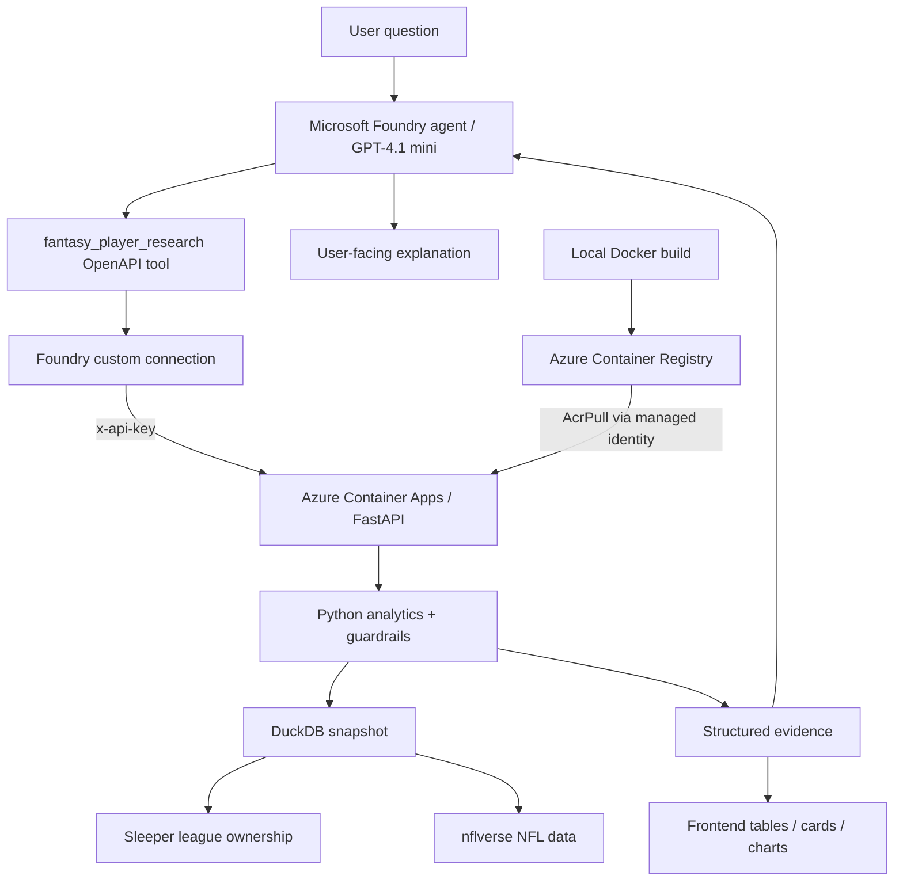
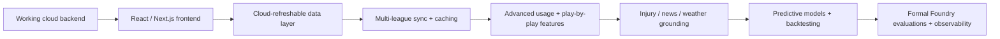

Fantasy Research Agent
Technical Project Journal, Architecture Notes, and Engineering Write-Up Source
A living document for learning, portfolio documentation, and a future public write-up.

Status: End-to-end cloud backend vertical slice complete; Microsoft Foundry successfully calls the secured Azure-hosted analytics API; frontend is the next major milestone
Primary goal: Build an evidence-first fantasy football research agent while gaining practical Microsoft Azure and Foundry experience
Core stack: Python, Sleeper API, nflverse, Polars, DuckDB, FastAPI, OpenAPI, Foundry Local, Microsoft Foundry, GPT-4.1 mini, Docker, WSL 2, Azure Container Registry, Azure Container Apps, Azure Managed Identity
Last updated: October 5, 2026
Table of Contents
1. Project Overview
2. Design Philosophy
3. Current Architecture
4. Component Guide
5. Why FastAPI Exists If Azure Already Exists
6. What Has Been Built So Far
7. How a User Question Flows Through the System
8. Key Engineering Decisions and Lessons
9. Docker and WSL in This Project
10. Current State and Immediate Next Milestones
11. Engineering Journey
12. Framing the Future Public Write-Up
13. Short Portfolio Summary
14. Repository Shape
15. Current Cloud Topology
16. How to Maintain This Journal
1. Project Overview
Fantasy Research Agent is an AI-assisted fantasy football research system designed to answer natural-language questions with league-specific, data-backed evidence.
The long-term product is not intended to be just another chatbot or a static start/sit page. The goal is to build something closer to a research analyst that understands a user's actual fantasy league, roster, scoring settings, player usage, ownership, availability, and eventually predictive context.
The project began with local data ingestion and deterministic analytics, then deliberately expanded into Microsoft Azure and Microsoft Foundry. The cloud work is not decorative. A major goal of the project is to learn how a modern AI application is actually assembled in practice: data pipelines, analytics, tool calling, API contracts, cloud deployment, permissions, containerization, observability, and eventually a production-style frontend.
Project thesis
The system is intentionally split into deterministic analytics and AI reasoning. Statistics are calculated by code and queried from structured data. The model decides what evidence it needs, calls the appropriate tool, and explains the returned result.

That separation is the foundation of the project.
2. Design Philosophy
The most important architectural decision is to separate calculation from interpretation.
Large language models are useful planners, researchers, and communicators, but they should not invent box-score numbers, ownership status, usage trends, or league context. The application therefore treats the model as the reasoning layer and deterministic code as the source of truth.
The system can be thought of as four cooperating roles:
- AI planner: interprets a freeform question and decides which tool, filters, metrics, and time window are needed.
- Python referee: validates tool arguments and enforces semantic guardrails, such as interpreting "available" as "unrostered."
- DuckDB calculator: executes joins, filters, averages, rankings, and trend calculations against structured data.
- AI explainer: turns returned evidence into a concise fantasy-football answer without fabricating statistics.
Evidence-first rule
The model may decide what to investigate, but the numbers must come from deterministic code and structured data. When evidence is missing or immature, the system should say so instead of silently substituting a guess.

This makes the application more reproducible, auditable, and easier to debug.
3. Current Architecture
The current system is intentionally layered.

During development there are currently two AI paths:
1. Foundry Local provides a local model runtime used as a development harness for structured tool calling.
2. Microsoft Foundry in Azure is the cloud orchestration layer that will ultimately call the hosted FastAPI tools.
The local path is useful for development and experimentation. The Azure path is the production-shaped architecture.
4. Component Guide
This section explains what each technology is in general and what it specifically does inside Fantasy Research Agent.
Component	What it is generally	Role in this project	Current state
Sleeper API	A public API for Sleeper fantasy leagues, users, rosters, scoring settings, and player metadata.	Supplies league-specific context: league ID, roster ownership, starters, bench, scoring rules, managers, and unrostered-player inference.	Implemented
nflverse / nflreadpy	Open NFL datasets exposed through a Python package.	Supplies weekly player stats, schedules, roster status, snap counts, and identifier mappings used to analyze actual NFL usage.	Implemented
Python	The main programming language for the backend.	Coordinates ingestion, cleaning, ID mapping, analytics, tool validation, API logic, and refresh workflows.	Implemented
Polars	A high-performance dataframe library.	Transforms Sleeper and nflverse-derived data before it is persisted or returned to the application.	Implemented
DuckDB	An embedded analytical SQL database optimized for local analytics.	Stores normalized tables such as player_week and league_ownership and performs fast joins, filters, averages, and trend calculations. The current cloud container includes a snapshot of this database.	Implemented; cloud snapshot currently baked into image
FastAPI	A modern Python web API framework.	Turns internal analytics functions into stable HTTP endpoints that a frontend or AI agent can call.	Deployed to Azure Container Apps
OpenAPI	A machine-readable standard for describing HTTP APIs.	Defines the agent-facing search_players contract and allows Foundry to call the backend as a tool.	Attached to Foundry agent
Uvicorn	An ASGI server used to run Python web applications.	Runs the FastAPI application inside the Docker container.	Implemented
Foundry Local	Microsoft's local AI runtime and SDK.	Used as a development harness to test structured tool calling with a local Qwen model before relying on cloud inference.	Implemented
Microsoft Foundry	Microsoft's cloud AI development and orchestration platform.	Hosts the project, GPT-4.1 mini deployment, prompt agent, connection, tool configuration, traces, and future evaluations.	End-to-end tool calling working
GPT-4.1 mini	A cloud language model deployment.	Interprets natural-language questions, calls the research tool, and explains deterministic evidence.	Deployed and tested
Docker	A containerization platform that packages an application and its dependencies into a reproducible image.	Packages FastAPI, Python dependencies, backend code, and the current DuckDB snapshot into the deployable backend image.	Working; v2 image built locally
WSL 2	Windows Subsystem for Linux, a lightweight Linux environment on Windows.	Provides the Linux environment Docker Desktop uses to build and run Linux containers from the Windows development machine.	Installed and working
Azure Container Registry (ACR)	A private registry for storing container images.	Stores versioned backend images such as fantasy-research-api:v1 and :v2.	Working
Azure Container Apps	A managed Azure service for running containerized web services without managing virtual machines.	Hosts the live FastAPI backend on HTTPS.	Deployed and working
Azure Managed Identity	An Azure identity assigned to a resource or workload.	Gives the Container App permission to pull the private image from ACR without storing registry credentials.	Implemented
Container Apps Secrets	Secret storage attached to an Azure Container App.	Stores the backend API key and exposes it to FastAPI through FANTASY_API_KEY.	Implemented
Foundry custom connection	A credential object used by Foundry tools.	Stores the x-api-key credential as a secret so the OpenAPI tool can authenticate to FastAPI without embedding the key in source or schema.	Implemented
Git + GitHub	Version control plus hosted source repository.	Tracks code, architecture notes, engineering decisions, project history, and this journal.	Implemented

5. Why FastAPI Exists If Azure Already Exists
A useful mental model is that Azure is the cloud platform, while FastAPI is the application.
Azure is not one database or one application framework. It is a large collection of cloud services that can host code, store data, run models, manage secrets, monitor systems, and provide networking.
For this project:
Azure                    = cloud platform
FastAPI                  = backend application / interface
DuckDB                   = current analytical data store
Microsoft Foundry        = AI orchestration and reasoning
Azure Container Apps     = hosting for FastAPI
Azure Container Registry = storage for the Docker image
FastAPI becomes the stable interface between the frontend, the AI agent, authentication, analytics, and storage.
For example, instead of allowing a model to directly rummage through the database, the model can call a controlled operation such as:
POST /tools/search-players
FastAPI receives that request, validates the arguments, invokes the deterministic analytics layer, and returns structured results.
That separation matters because the storage implementation can change later without forcing the rest of the application to change. DuckDB could eventually be supplemented or replaced by an Azure-hosted database, while the frontend and Foundry agent can continue calling the same API contract.
6. What Has Been Built So Far
6.1 League and player data foundation
The ingestion pipeline accepts a Sleeper username, identifies the active league and roster, loads league ownership, maps Sleeper player IDs to nflverse/GSIS identifiers, loads weekly NFL data, and writes normalized analytics tables to DuckDB.
The current refresh pipeline produces data for:
- player identity
- roster mapping
- league ownership
- weekly player statistics
- snap counts
- weekly roster status
- NFL schedules
- unified player_week rows
The player_week table is especially important because it gives later research tools a consistent row-per-player-per-week source.
6.2 Schedule-aware analytics
The project explicitly distinguishes fully completed NFL weeks from partial current-week data.
Trend calculations use only completed weeks, and the tool refuses to report a trend when fewer than two completed weeks are available. This prevents mathematically valid-looking but misleading slopes from being presented as meaningful trends.
This is a small implementation detail with a large reliability benefit.
6.3 Generic player research tool
Instead of hard-coding a separate function for every possible fantasy question, the backend uses a composable search_players() tool.
A call can look conceptually like this:
search_players(
    position="WR",
    availability="unrostered",
    sort_by=["avg_targets", "avg_snap_pct"],
    last_n_weeks=3,
    limit=10,
)
The same tool supports:
- position filtering
- ownership / availability filtering
- multiple ranking metrics
- numerical filters
- recent-week windows
- usage trends
- fantasy-point trends
This approach scales much better than creating a unique function for every natural-language question.
6.4 Structured local agent
The local AI prototype originally experimented with direct text-to-SQL generation. That proved too fragile because a model could produce invalid queries or misunderstand the data model.
The architecture evolved into structured tool calling.
The model now requests a defined tool with structured arguments. Python validates those arguments, executes deterministic analytics, and returns the result to the model for explanation.
A semantic guardrail also corrects important intent mismatches. For example, if the user asks for "available" players, Python enforces unrostered availability even if the model proposes a broader value.
The agent also falls back gracefully when trend evidence is not yet mature rather than pretending a projection exists.
6.5 FastAPI boundary
The deterministic search tool is now exposed through FastAPI.
The local service successfully starts with Uvicorn and provides:
http://127.0.0.1:8000/docs
http://127.0.0.1:8000/openapi.json
/docs exposes interactive Swagger documentation for a developer. /openapi.json exposes the same API contract in a machine-readable form.
This is the boundary that turns internal Python functions into a service that other systems can call.
6.6 Microsoft Foundry cloud setup
A Microsoft Foundry resource and project have been created in Azure.
Current cloud configuration includes:
- Azure for Students subscription
- resource group rg-fantasy-research-agent
- Foundry resource fantasy-research-foundry-nj
- Foundry project fantasy-research-agent
- gpt-4.1-mini deployment
- prompt agent fantasy-research-agent
The agent instructions emphasize that it should prefer tool-provided evidence and should not invent statistics, injuries, matchups, or league information.
Azure role-based access control also became part of the setup. Infrastructure ownership alone did not provide the required Foundry data-plane access, so the Foundry User role had to be assigned.
6.7 Dockerized backend and Azure deployment
The FastAPI backend is now packaged as a Linux Docker image and has been validated in two environments:
1. locally through Docker Desktop, and
2. remotely through Azure Container Apps.
The first working image was tagged v1 and pushed to Azure Container Registry. A later v2 image added API-key authentication.
Because Azure for Students did not permit ACR Tasks, the image is built on the development machine and then pushed to ACR. Azure Container Apps pulls the image from the private registry using a user-assigned managed identity with the AcrPull role.
The public Azure service exposes /health, /docs, and the protected analytics endpoint over HTTPS.
6.8 API security and secret handling
The agent-facing analytics endpoint is protected with an x-api-key header.
The secret is deliberately kept out of source control:
Foundry custom connection
        ↓ x-api-key
Azure Container Apps HTTPS endpoint
        ↓
FastAPI APIKeyHeader validation
        ↓
FANTASY_API_KEY environment variable
        ↓
Container Apps secret
The API key is stored as a secret in Azure Container Apps and injected into the container as an environment variable. The same credential is stored as a secret inside a Foundry custom connection. The OpenAPI schema declares the header name but never contains the actual secret value.
6.9 Foundry OpenAPI tool integration
The cloud agent now has a custom OpenAPI tool named fantasy_player_research.
The tool exposes the deterministic search_players capability with structured fields for position, availability, ranking metrics, filters, recent-week windows, and limits.
An important debugging lesson occurred here: creating an OpenAPI tool resource was not enough by itself. The tool also had to be attached to the active agent version and saved. A Foundry trace initially showed several model calls and zero tool calls, which explained why the model fabricated placeholder players when it failed to use the backend.
After attaching the tool correctly, the trace and response behavior changed to the intended architecture.
6.10 First successful end-to-end cloud research query
The first successful end-to-end test asked the Foundry agent:
"What unrostered WRs in my league have the strongest target volume? Give me the top 5 and explain briefly using the data."

The agent called the Azure-hosted research tool and returned real player names plus target, snap-share, and PPR evidence from the backend.
This proved the full cloud path:
natural-language question
→ GPT-4.1 mini Foundry agent
→ OpenAPI tool
→ secret-backed API key
→ Azure Container Apps
→ FastAPI
→ deterministic analytics
→ DuckDB
→ structured evidence
→ model explanation
This is the project's first complete cloud vertical slice.
7. How a User Question Flows Through the System
A user can now ask a question such as:
"What unrostered WRs in my league have the strongest target volume?"

The current cloud flow is:
1. The user asks a freeform fantasy question in the Foundry agent.
2. GPT-4.1 mini interprets the request.
3. The agent selects the fantasy_player_research OpenAPI tool.
4. Foundry supplies the secret x-api-key through the configured custom connection.
5. The tool sends an HTTPS request to the FastAPI service running in Azure Container Apps.
6. FastAPI authenticates the request and validates the structured arguments.
7. The deterministic Python analytics layer queries DuckDB.
8. DuckDB combines league ownership and nflverse-derived player data.
9. FastAPI returns structured player rows and calculated metrics.
10. GPT-4.1 mini explains those returned facts to the user.
Why this flow matters
The model is not being asked to "remember" fantasy football data or calculate rankings from prose. It receives a controlled way to retrieve league-specific evidence.
The same structured response can later power a React frontend, tables, player cards, and charts without asking the model to manufacture display data.
Current limitation
The cloud container currently carries a snapshot of the DuckDB database from the local refresh pipeline. The cloud path works, but it is not yet continuously refreshed.
That distinction matters:
The cloud reasoning and API architecture are working, but the data-persistence layer is still development-stage rather than production-live.

The next backend evolution will move refreshable data into an Azure-backed persistence/synchronization design.
8. Key Engineering Decisions and Lessons
8.1 Deterministic analytics over model-generated numbers
The model is intentionally prevented from becoming the calculator.
Fantasy statistics, roster availability, and rankings are produced by queryable data and code. This increases reproducibility and makes debugging possible.
8.2 Generic tools over endpoint explosion
The application avoids building a unique function for every possible fantasy question.
A smaller set of composable tools can cover many questions by changing parameters. This keeps the backend maintainable while still allowing flexible AI planning.
8.3 Partial-week data is a first-class problem
Sports data is constantly changing.
A naive average can mix completed games with partial current-week records. The schedule table therefore acts as a source of truth for completed weeks, and trend logic uses that boundary explicitly.
8.4 Missing data is not zero
An absent box-score record, an inactive player, and a player who actually recorded zero usage are different states.
The system preserves nulls where appropriate rather than silently turning missing values into fake performance.
8.5 Azure permissions have multiple layers
The cloud setup exposed a useful distinction between control-plane permissions and service-specific data-plane permissions.
Owning the Azure resource did not automatically grant the permissions required to create and use Foundry agents. The Foundry User role was required separately.
8.6 Cloud provider registration is infrastructure setup
Before Container Apps could be used, the subscription needed Azure resource providers such as:
Microsoft.App
Microsoft.OperationalInsights
Microsoft.ContainerRegistry
These are Azure platform prerequisites, not bugs in application code.
8.7 Student subscription limitations can affect deployment strategy
The first Container Apps deployment attempt used Azure Container Registry Tasks to build the Docker image in the cloud.
Azure for Students did not permit that ACR Tasks operation. Rather than abandoning the architecture, the project changed the build path:
Local Docker build
        ↓
Azure Container Registry
        ↓
Azure Container Apps
This preserves the same production architecture while moving the image build step onto the development machine.
Engineering takeaway
A failed cloud deployment is not automatically a code failure. Application errors, identity problems, subscription restrictions, networking issues, provider registration, and platform constraints are different categories of failure and should be debugged separately.

8.8 Use managed identity for private container pulls
The Container App uses a user-assigned managed identity with the AcrPull role rather than storing Azure Container Registry credentials.
This keeps infrastructure authentication separate from application-level API authentication.
8.9 Store application secrets outside source control
The FastAPI tool endpoint requires an API key, but the key is not committed to GitHub and is not embedded in the OpenAPI document.
Azure Container Apps stores the backend copy as a secret. Microsoft Foundry stores the caller copy in a secret custom connection.
8.10 Treat agent traces as part of debugging
When the Foundry agent produced fake placeholder players, the failure initially looked like a model-quality problem.
The trace showed a more precise cause: five model/chat calls occurred and no tool invocation occurred. This changed the debugging target from the data backend to the agent configuration.
The resulting lesson is:
In agentic systems, inspect the execution path before rewriting prompts or backend code. A wrong answer can originate from orchestration rather than reasoning or data.

8.11 Tool creation and tool attachment are separate concerns
A custom OpenAPI tool can exist without being attached to the active agent version.
The project therefore treats tool attachment and agent save/version state as explicit deployment steps rather than assuming tool creation automatically changes agent behavior.
8.12 Rate-limit quota is capacity, not evidence of spend
The GPT-4.1 mini deployment encountered a token-per-minute rate limit once the agent carried larger instructions and tool schemas. The development quota was raised to 50K TPM.
This allocation controls request throughput. It should not be confused with continuously consuming 50K tokens per minute.
9. Docker and WSL in This Project
Docker
Docker solves environment reproducibility.
Before containerization, the backend depends on the development machine having the correct Python version, installed packages, source code, data files, and startup command.
A Dockerfile records that runtime as a recipe.
Conceptually:
Docker image
├── Linux runtime
├── Python 3.13
├── FastAPI
├── DuckDB / analytics dependencies
├── backend source code
└── startup command
Docker builds that recipe into a container image that can run consistently on the developer machine or in Azure.
The important shift is from:
"This Python program works on my laptop."

To:
"This application has an explicitly defined runtime that can be deployed elsewhere."

WSL 2
WSL stands for Windows Subsystem for Linux.
The project itself does not need to be rewritten for WSL. WSL is development infrastructure beneath Docker Desktop.
Most cloud containers run Linux. Docker Desktop uses WSL 2 to provide Linux capabilities on a Windows computer, allowing the machine to build and run Linux containers locally.
Windows development machine
└── WSL 2
    └── Linux environment
        └── Docker Engine
            └── Fantasy Research Agent container
In this project, the relationship is therefore:
Windows = normal development environment
WSL 2   = Linux capability for Docker
Docker  = packages and runs the application consistently
Azure   = runs the packaged application in the cloud
10. Current State and Immediate Next Milestones
Area	State	Notes
Data ingestion	Complete for v1	Sleeper + nflverse refreshes into DuckDB.
Deterministic analytics	Complete for v1	Generic player search and schedule-aware trend guards are working.
Local AI tool calling	Complete	Foundry Local can request structured tools and explain returned evidence.
FastAPI	Live	Runs locally and in Azure Container Apps.
API authentication	Complete for current tool	x-api-key validated by FastAPI; secret stored outside Git.
Docker / WSL 2	Complete	Linux image builds and runs locally.
Azure Container Registry	Complete	Versioned backend images pushed successfully.
Managed identity	Complete	Container App pulls private ACR image using AcrPull.
Azure Container Apps	Live	Public HTTPS backend is deployed.
Foundry cloud project	Complete	GPT-4.1 mini agent is configured.
Foundry custom connection	Complete	Secret API-key credential is stored in Foundry.
OpenAPI research tool	Complete	fantasy_player_research is attached to the active agent.
End-to-end cloud query	Complete	Natural language → Foundry → Azure API → DuckDB → evidence → answer is working.
Frontend	Next major milestone	Build against real endpoints and real returned data rather than mocks.
Cloud data persistence	Next backend phase	Replace baked DuckDB snapshot with refreshable Azure-backed storage/sync.
Multi-league sync / caching	Planned	Add user→league→roster mapping and scheduled/background ingestion.
Play-by-play features	Planned	Add richer opportunity and expected-value metrics from nflverse data where feasible.
Injury/news/weather grounding	Planned	Use live structured sources plus retrieval for unstructured context.
Predictive modeling	Planned	Add forward-looking projections and backtesting after data pipelines mature.
Tracing / evaluation	Partially implemented	Foundry traces already used for debugging; formal evaluations come later.

Immediate path from here

Why frontend starts now
The project now has one complete vertical slice from a natural-language question to a real deterministic answer. That is enough backend stability to begin UI development without relying on fake frontend data.
The backend is not "finished." It is simply mature enough that later infrastructure and analytics upgrades can be added behind a real product surface instead of delaying the interface indefinitely.
11. Engineering Journey
This section records not only what was built, but why the architecture changed along the way. These notes are particularly useful for a future technical article or interview discussion.
Milestone: Building the data foundation
Problem
Fantasy questions require both NFL performance data and league-specific context. Raw NFL stats alone cannot answer questions about waivers, rosters, or scoring rules.
Decision
Combine Sleeper league data with nflverse NFL data, normalize identifiers, and store the resulting analytical data locally in DuckDB.
What this taught
Real applications often need multiple data sources with incompatible identifiers. ID mapping and normalization are not glamorous, but they are foundational to reliable analytics.
Milestone: Moving from text-to-SQL to structured tools
Problem
Allowing a small local model to freely generate SQL created brittle behavior, invalid queries, and greater hallucination risk.
Decision
Expose a smaller set of deterministic tools with structured arguments. Let the language model decide which operation to request, but let Python control how it is executed.
What this taught
AI systems become more dependable when model freedom is concentrated at the reasoning boundary rather than the data-calculation boundary.
Milestone: Introducing FastAPI
Problem
The analytics functions worked inside Python, but Microsoft Foundry and a future web frontend need a network-accessible interface.
Decision
Expose deterministic operations through FastAPI. Use automatically generated OpenAPI documentation as the machine-readable tool contract.
What this taught
An API is not the database. It is the controlled interface through which other applications request operations from the backend.
Milestone: Moving from local AI to Microsoft Foundry
Problem
The project needed a cloud AI orchestration layer rather than relying entirely on a local model runtime.
Decision
Create a Microsoft Foundry resource and project, deploy GPT-4.1 mini, and configure a cloud agent designed to use deterministic tools.
What this taught
Cloud AI development includes much more than selecting a model. Identity, RBAC, deployment regions, model deployments, tool contracts, and monitoring all become part of the application architecture.
Milestone: Containerizing the backend
Problem
The FastAPI backend worked locally, but Azure cannot depend on the exact configuration of the development laptop.
Decision
Use Docker to define a reproducible application runtime and deploy the resulting image through Azure Container Registry and Azure Container Apps.
What this taught
Containers separate the application's runtime environment from the machine on which it executes. The Docker image becomes the deployable artifact rather than a loose collection of source files and installation instructions.
Milestone: ACR Tasks limitation on Azure for Students
Problem
az containerapp up --source . attempted to use Azure Container Registry Tasks to build the image remotely. The student subscription rejected ACR Tasks with TasksOperationsNotAllowed.
Decision
Install Docker Desktop and WSL 2, build the image locally, then push the finished image to Azure Container Registry.
What this taught
Cloud architecture often survives even when an implementation path changes. The final deployment target did not need to change; only the build stage moved from Azure infrastructure to the local development machine.
Milestone: Building and validating the first container image
Problem
The application needed to prove that it could run outside the Windows/Python virtual environment where it was developed.
Decision
Build fantasy-research-api locally with Docker, run the container on port 8000, and test the FastAPI /health, /docs, and /tools/search-players endpoints from the browser.
Result
The container returned real league/player analytics from the packaged DuckDB snapshot.
What this taught
A successful container test is stronger than simply having a valid Dockerfile. It proves the packaged runtime can execute the real application and data path.
Milestone: Deploying the backend to Azure Container Apps
Problem
Microsoft Foundry is cloud-hosted and cannot call 127.0.0.1 on the development laptop.
Decision
Push the locally built image to Azure Container Registry and run it in Azure Container Apps.
A user-assigned managed identity was given the AcrPull role so the Container App could retrieve the private image without storing registry credentials.
Result
The FastAPI backend became reachable through a public HTTPS endpoint in Azure.
What this taught
Deployment identity and application identity are separate concerns. Managed identity handles Azure-to-Azure infrastructure access, while the application can still use its own authentication scheme for callers.
Milestone: Securing the analytics API
Problem
The first Azure API was publicly reachable and the analytics endpoint had no caller authentication.
Decision
Add FastAPI APIKeyHeader authentication, store the secret in Azure Container Apps, and inject it through FANTASY_API_KEY.
A Foundry custom connection stores the corresponding x-api-key credential as a secret for tool calls.
Result
Requests without the key receive 401 Unauthorized; valid authenticated requests can execute the analytics tool.
What this taught
Secrets should be configuration, not source code. The OpenAPI contract can describe how authentication works without containing the secret itself.
Milestone: Debugging the first Foundry tool failure
Problem
The Foundry agent initially responded with fabricated placeholder players such as "Player A" and "Player B" instead of real backend results.
Investigation
Foundry traces showed several chat/model spans but no tool-call span.
Root cause
The custom OpenAPI tool had been created, but it was not actually attached and saved on the active agent version.
Resolution
Attach fantasy_player_research to the agent, strengthen instructions against fabrication, save the agent version, and retry.
What this taught
Agent orchestration must be observable. A hallucinated answer is not always evidence of bad data or a weak model; it can be evidence that the expected tool never ran.
Milestone: First successful cloud agent loop
Result
The Foundry agent successfully answered a league-specific waiver question with concrete player names and real target/snap/PPR evidence returned by the Azure-hosted API.
Why it matters
This was the first time every major layer operated together:
Foundry reasoning
→ OpenAPI tool
→ secret-backed connection
→ Azure Container Apps
→ FastAPI
→ deterministic analytics
→ DuckDB
→ Sleeper + nflverse evidence
→ user-facing explanation
The project now has a functioning production-shaped backend vertical slice and can move into frontend development.
12. Framing the Future Public Write-Up
A strong public version of this project should focus less on:
"I built a fantasy football chatbot."

and more on the actual engineering problem:
How do you combine LLM reasoning with deterministic, league-specific sports analytics without allowing the model to fabricate the evidence underneath its answer?

Possible headline
Building an Evidence-First Fantasy Football Research Agent with Microsoft Foundry, FastAPI, and NFL Data
Possible opening paragraph
I wanted to build something more useful than another fantasy football chatbot. The interesting problem was not getting an LLM to talk about football; it was getting an AI agent to investigate a real league, call deterministic analytics tools, respect incomplete sports data, and explain evidence it did not invent. That led to a layered architecture built around Sleeper, nflverse, DuckDB, FastAPI, Docker, Azure Container Apps, and Microsoft Foundry.

Technical themes worth highlighting
- Why tool calling is safer and more maintainable than asking an LLM to generate statistics directly.
- How a generic analytics tool can support many natural-language questions without creating hundreds of one-off functions.
- How schedule-aware logic prevents partial NFL weeks from corrupting trend analysis.
- How FastAPI and OpenAPI create the contract between deterministic analytics, AI agents, and a future frontend.
- How Docker turns a local Python application into a portable cloud deployment artifact.
- What Azure RBAC, resource-provider registration, managed identity, Container Registry, Container Apps, and secret management taught during deployment.
- How Foundry tracing exposed a tool-attachment failure that otherwise looked like an LLM hallucination problem.
- Why the project begins with historical evidence and deliberately postpones true forecasting until a predictive model is justified.
13. Short Portfolio Summary
Fantasy Research Agent is an AI-powered fantasy football research application that combines Sleeper league context with nflverse NFL data. I built a Python analytics pipeline that normalizes player usage, snap counts, ownership, roster status, and schedule information into DuckDB, then exposed reusable research tools through a secured FastAPI/OpenAPI service. The backend is containerized with Docker, stored in Azure Container Registry, and deployed to Azure Container Apps using managed identity for private image pulls. A GPT-4.1 mini agent in Microsoft Foundry calls the API through a secret-backed custom connection and explains deterministic league-specific evidence rather than inventing statistics. The first end-to-end cloud research query is working; the next major milestone is the frontend, followed by cloud-refreshable data, richer live context, and predictive modeling.
14. Repository Shape
Current approximate project structure:
fantasy-research-agent/
├── backend/
│   ├── ai/
│   │   ├── foundry_local.py
│   │   ├── research_agent.py
│   │   └── tool_agent.py
│   ├── services/
│   │   ├── analytics.py
│   │   ├── fantasy_data.py
│   │   ├── league_data.py
│   │   ├── player_tools.py
│   │   ├── player_week.py
│   │   ├── research.py
│   │   ├── schedule_data.py
│   │   └── visualization.py
│   ├── api.py
│   ├── database.py
│   ├── nflverse.py
│   ├── refresh_data.py
│   ├── requirements-api.txt
│   └── sleeper.py
├── data/
│   ├── cache/
│   └── database/
├── docs/
│   ├── ARCHITECTURE.md
│   ├── DATA.md
│   ├── DECISIONS.md
│   ├── STATUS.md
│   └── PROJECT_JOURNAL.md
├── frontend/
├── Dockerfile
├── .dockerignore
└── README.md
15. Current Cloud Topology
Azure for Students
└── Resource group: rg-fantasy-research-agent
    │
    ├── Microsoft Foundry resource: fantasy-research-foundry-nj
    │   └── Project: fantasy-research-agent
    │       ├── GPT-4.1 mini deployment
    │       │   └── development allocation: 50K TPM
    │       ├── prompt agent: fantasy-research-agent
    │       ├── OpenAPI tool: fantasy_player_research
    │       └── custom connection
    │           └── secret credential: x-api-key
    │
    ├── User-assigned managed identity
    │   └── fantasy-research-api-identity
    │       └── AcrPull on private registry
    │
    ├── Azure Container Registry
    │   └── fantasy-research-api
    │       ├── v1
    │       └── v2  [API-key secured]
    │
    └── Azure Container Apps environment: fantasy-research-api-env
        └── fantasy-research-api
            ├── public HTTPS ingress
            ├── FastAPI / Uvicorn
            ├── Container Apps secret: fantasy-api-key
            └── current DuckDB snapshot
Runtime request path
Foundry agent
    ↓
fantasy_player_research
    ↓
Foundry custom connection supplies x-api-key
    ↓ HTTPS
Azure Container App
    ↓
FastAPI authenticates request
    ↓
search_players()
    ↓
DuckDB analytics
    ↓
structured evidence
    ↓
Foundry explanation
Deployment path
Source code + DuckDB snapshot
    ↓
local Docker build
    ↓
versioned container image
    ↓
Azure Container Registry
    ↓ managed identity / AcrPull
Azure Container Apps
Important current limitation
The cloud runtime still contains a baked database snapshot. This was intentional for the first vertical slice because it allowed the application, networking, authentication, tool calling, and cloud deployment path to be proven independently.
The next backend phase will make the data layer refreshable in Azure. Likely options include a relational Azure database for application/league state plus scheduled synchronization and appropriate storage for analytical datasets.
The project should not claim that the current cloud data is continuously live until that refresh layer exists.
16. How to Maintain This Journal
This file is intended to be the human-readable source of truth for the project's story.
It should not replace narrow technical documentation such as ARCHITECTURE.md, DATA.md, DECISIONS.md, or STATUS.md. Instead, it connects those details into an understandable narrative.
Update rule
Update this journal at meaningful engineering milestones, not after every tiny code change.
Good moments to update it include:
- a cloud deployment succeeds
- a major architecture decision changes
- a new data source is added
- the Foundry agent begins calling the hosted API
- the frontend becomes usable
- authentication or multi-user support is introduced
- data refresh is moved into Azure
- predictive modeling is added
- monitoring / tracing is enabled
Suggested update format
When a milestone happens, add or revise a section using this pattern:
## Milestone: <name>

### Problem
What limitation or engineering need existed?

### Decision
What was implemented and why?

### Result
What now works that did not work before?

### What I learned
What broader engineering concept did this teach?
This format preserves material that can later be converted directly into a portfolio case study, interview explanation, LinkedIn post, or Substack article.
Git workflow
After editing the journal:
git add docs/PROJECT_JOURNAL.md
git commit -m "Update project engineering journal"
git push
GitHub will render the Markdown directly in the browser, including headings, tables, code blocks, links, and Mermaid diagrams.
Living document: This journal should evolve with the project. The polished DOCX/PDF versions are snapshots; docs/PROJECT_JOURNAL.md is the maintainable source that records why the system exists, how it works, and how the architecture changes over time.